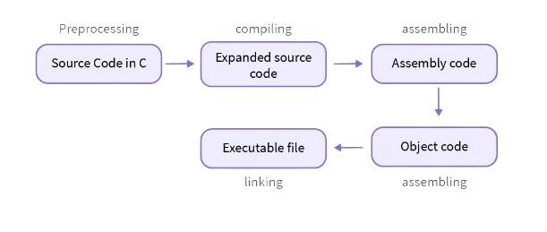

# Compiling and Running a C program

## Compilers

Compiler is a program that translates a C program to machine code or an intermediate code that can be understood by the system. It involves many the following steps:  `preprocessing`, `compiling`, `assembling` and `linking`. 



### Pre-processing
The pre-processor removes the comments from the files and adds additional components in the code like:
* addition of the definitions under the header files added through `#include<*.h>`
* addition of macros defined

This step creates an additional intermediate file with a `.i` extension.

### Compiling
The intermediate file is then compiled to assembly code that is sent to the assembler.

### Assembler
The assembler converts the compiled file to machine code and creates an object file (with `.o` extension)

### Linker
Linker links the library files with the object code where all the linking of function calls with their definitions is done. The final output by default is an executable file that can run directly on system.

## The GCC Compiler

GCC (GNU Compiler Collection) is one of the popular package that provides standarized compiler tools for C and C++. It can be installed on most systems including Windows, Linux Distros and macOS.

### GCC on windows

GCC can be installed on windows using the [MYSY2 utility](https://github.com/msys2/msys2-installer/releases/download/2023-05-26/msys2-x86_64-20230526.exe) tool. To install:

* click on the hyperlink above and install the program using the setup file.
* launch the program once installed
* paste this code in the active shell
```sh
pacman -S --needed base-devel mingw-w64-ucrt-x86_64-toolchain
```
* Select the default option and let the download complete.
* Add `C:\msys64\ucrt64\bin` (or the location of your `bin` installation) [to the PATH variable](https://stackoverflow.com/questions/9546324/adding-a-directory-to-the-path-environment-variable-in-window).

### GCC on linux
Most linux distros come with `gcc` pre-installed or as a dependency of some software you are using already. If you still want the to use the latest version of GCC, update it using the package manager of your choice.

Heres a shell script for ubuntu users: [ubuntu_installer.sh](https://github.com/externref/c_cpp/blob/main/ubuntu_installer.sh)

### GCC on macOS
GCC is available as a homebrew package and can be installed using `brew install gcc`. However, `clang` is much popular for development in macOS environments. 
